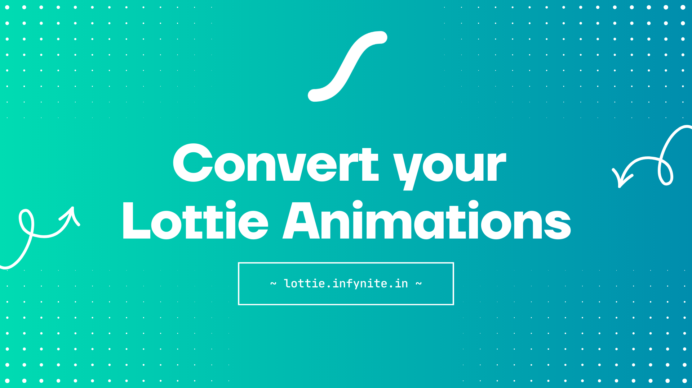

# Lottie Editor

A simple web application for converting and previewing Lottie & TGS animations.



## Getting Started

Install dependencies:

```bash
pnpm install
```

Run the development server:

```bash
pnpm dev
```

Open [http://localhost:3000](http://localhost:3000) in your browser.

## Build

Build for production:

```bash
pnpm build
```

Start the production server:

```bash
pnpm start
```

## License

This project is licensed under the MIT License - see the [LICENSE](LICENSE) file for details.
